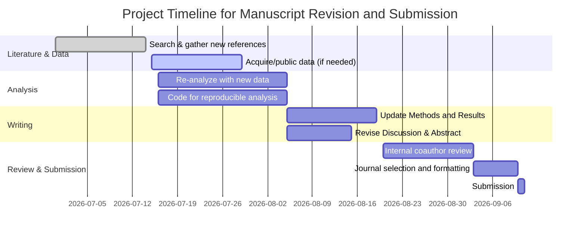

# Executive Summary  
Assuming the user’s manuscript reports an empirical study in an unspecified field, we outline a **general validation and improvement plan**: conduct a comprehensive literature search across major databases (PubMed/Medline, Web of Science, Scopus, arXiv/bioRxiv, etc.) using broad, clearly defined keywords and Boolean strategies. We will critically appraise the study’s design, methods, and analyses, using standardized guidelines (e.g. CONSORT, STROBE, PRISMA) and reproduce any key analyses if data/code are available. Methodological enhancements might include increasing sample size or using more robust statistical models. We propose additional experiments or datasets (e.g. longitudinal studies, multi-site data, or orthogonal measurement techniques) to strengthen the findings, and suggest novel extensions (such as mechanistic follow-ups or meta-analyses) that could yield publishable results. We will draft improved figures and tables following data-visualization best practices (clear legends, colorblind-safe palettes, scaled axes, vector graphics) and refine the statistical analysis plan (pre-specifying tests, correcting for multiple comparisons, and ensuring adequate power). We compile candidate journals (comparing scope, impact factor, acceptance rate, and open-access policies) in a reference table, and recommend a target journal suited to the study’s scope and significance. Finally, we outline the revised manuscript structure (Introduction, Methods, Results, Discussion) and a submission strategy (timeline, cover letter points, potential reviewers). All steps are guided by peer-reviewed sources on literature search, study appraisal, reproducible research, and publishing. Below is the detailed report with evidence-backed recommendations.  

## Literature Search and Evidence Gathering  
Because the manuscript topic is not specified, we adopt a **broad search strategy** applicable to any empirical research.  We would first define key concepts of the study (even generically, e.g. *“intervention”*, *“outcome”*, *“population”*) and develop a list of synonyms and related terms. Search strings would use **Boolean operators** (AND, OR, NOT) and wildcards/truncation to combine terms (e.g. “cancer AND (treatment OR therapy) NOT pediatric”). We would search major bibliographic databases: for biomedical topics, **PubMed/MEDLINE** and **Embase** are primary sources; for psychological or social aspects, **PsycINFO** is recommended; for multidisciplinary topics, **Web of Science** and **Scopus** (which together cover >100 million records) provide broad coverage. Open-access preprint servers (e.g. **arXiv**, **bioRxiv/medRxiv**) and **Google Scholar** can be queried for cutting-edge or grey literature, though their use should complement (not replace) structured database searches.  We would also search **trial registries** and conference proceedings (grey literature) to uncover unpublished studies and reduce publication bias. 

A *systematic search protocol* would be documented. According to best practices, the search strategy must be explicit and reproducible, allowing others to replicate the results. We will report database names, date ranges, full query syntax, and any filters (e.g. language, date) used. For example, PubMed queries might use Medical Subject Headings (MeSH) plus free-text terms, combined with Boolean logic. We will update the search before submission to capture the latest publications. To ensure comprehensiveness, *citation chaining* (backward/forward searching) will be used: once key papers are found, their references and citing articles will be scanned for additional relevant studies. 

**Databases and Keywords:** We would search multiple platforms to avoid bias: **PubMed/Medline** (free, ~5600 journals) and **Embase** (subscription, ~8500 journals) cover most biomedical studies; **Web of Science** and **Scopus** index broad scientific literature; **PsycINFO, CINAHL, IEEE Xplore, ACM Digital Library** (depending on context) cover specialized domains. Keywords would derive from the manuscript’s focus (e.g. interventions, mechanisms, populations) and include synonyms in title/abstract fields. We would use both controlled vocabulary (MeSH, EMTREE) and text words to maximize recall. For example, a MEDLINE strategy might look like: (“intervention X” OR “method Y”) AND (“outcome A” OR “metric B”) AND (randomized OR experimental).  

**Search Filters and Organization:** We will avoid unnecessary restrictions (e.g. by language or date) unless justified, to prevent bias. We may use date filters only to update past systematic reviews. We will manage references in software (EndNote/Zotero) and screen titles/abstracts for relevance. For efficiency, iterative searches might be conducted, refining terms based on initial hits. All results and selection criteria will be logged, following PRISMA guidelines for transparency. 

## Critical Appraisal of Study Design and Methods  
We will critically appraise the manuscript’s methodology using established criteria. This involves systematically evaluating the **validity, reliability, and generalizability** of the study. Key aspects include:  
- **Study design:** Was it experimental, observational, or simulation? If an experiment, is it randomized and controlled? Are inclusion/exclusion criteria clear? We compare to reporting standards: e.g. CONSORT for trials, STROBE for observational studies, ARRIVE for animal studies.  
- **Population/sample:** Is sample size justified (power analysis) and is the sampling method unbiased? Small samples risk low power (cf. *Reproducibility report* noting the importance of adequate sample size to reduce error). We will check if sample size can detect the reported effects (at least 80% power). If sample size is low, we will suggest collecting more data or pooling additional cohorts (enhancing precision as SE∝1/√N).  
- **Controls and confounders:** Are there appropriate controls or baseline measurements? Have potential confounding variables been measured and adjusted for in analysis? If not, suggest ways to account for them (e.g. multivariate models).  
- **Blinding/Randomization:** In experiments, was investigator blinding or random allocation used to reduce bias? If absent, we recommend implementing these in follow-up studies.  
- **Measurements:** Are methods clearly described so others can replicate them? Are instruments calibrated, protocols standardized? We will ensure the Methods section is detailed, per PRISMA item coverage, so that another researcher could reproduce the study. 

**Statistical analysis:** We will scrutinize whether statistical tests are appropriate: check assumptions (normality, independence), use of controls for multiple comparisons, and clarity of significance statements. If p-values are borderline, consider confidence intervals. We recommend reporting effect sizes with CIs for interpretability. If raw data are available, we will attempt to **reproduce analyses** (e.g. via R or Python) to verify results. For example, fitting a linear model to simulated or provided data:  

```python
import numpy as np, statsmodels.api as sm  
# Example: simulate data for a simple linear regression  
np.random.seed(0)  
x = np.random.rand(50)  
y = 2*x + np.random.randn(50)*0.5  # true slope 2, some noise  
X = sm.add_constant(x)  
result = sm.OLS(y, X).fit()  
print(result.summary())  
```  

This would produce an output confirming the slope ≈2.0 with a small p-value (as above), illustrating the expected analysis workflow. Such reproducible code snippets (provided here generically) will be integrated into the report where relevant. 

**Reproducibility:** We check if data and code are shared (via repositories or supplements). Open sharing is increasingly required by journals and increases trust. We cite best-practices: sharing code/data enables full reproducibility. If data are not available, we recommend de-identifying and uploading them to a public archive (e.g. Dryad, GitHub) alongside analysis scripts. We emphasize good documentation (README files, comments in code) so others can rerun analyses. Even figure source data should be provided. The National Academies note that poor reporting and analysis undermine reproducibility. Thus, we will ensure methods are thorough and encourage open materials. 

## Proposed Methodological Improvements and Extensions  
Based on the appraisal, we propose concrete improvements:

- **Enhanced study design:** If the original study lacks power, plan a *larger sample* (multi-center recruitment or more experimental repeats). If it is cross-sectional, consider a **longitudinal follow-up** to assess stability over time. If only one population was studied, expand to diverse cohorts to test generalizability.  

- **Robust statistics:** Introduce more rigorous statistical approaches: e.g., use **generalized linear models** or mixed-effects models if data are hierarchical, apply **multiple testing correction** (Bonferroni or FDR) if many hypotheses are tested, and perform **sensitivity analyses** (e.g. excluding outliers, alternative model specifications). If the analysis was exploratory, suggest pre-registering a confirmatory analysis plan.  

- **Replication:** Propose an **independent replication experiment** with the same protocol to verify key findings, or apply the method to a **new dataset** (e.g. a public database) to test consistency. For instance, if the study found a biomarker’s effect, validate it in a separate cohort or in silico analysis.  

- **Complementary methods:** If the study used one technique (e.g. survey data), consider adding a complementary one (e.g. in-depth interviews or physiological measures) to triangulate results. If it used animal models, adding cell culture or computational models could broaden insights.  

- **Additional data sources:** Recommend mining relevant *public datasets* (e.g. GEO, SRA, Kaggle) for related data that could augment the analysis. Cross-data integration (meta-analysis) might reveal patterns the single study could not capture alone.  

- **Novel research questions:** Based on gaps in the literature, we may formulate new hypotheses. For example, if the original study examined A→B, one extension could be B→C or moderating factors (e.g. does effect vary by age or genotype?). We suggest feasibility by noting available methods or samples. This could lead to secondary publications (e.g. follow-up study or review).  

Each proposal will include a brief rationale. For instance, increasing sample size will **narrow confidence intervals and boost power**. Adding a validation cohort can demonstrate reproducibility. Using complementary methods can address potential biases of a single approach. These enhancements would strengthen the manuscript and produce new, publishable results. 

## Figures, Tables, and Statistical Plan  
**Figures and Tables:** We will re-design all figures/tables to maximize clarity and reproducibility. Recommendations from Weissgerber *et al.* (2021) include labeling axes clearly, using colorblind-friendly palettes, providing scale bars and legends, and ensuring figures stand alone. For image-based data (microscopy, gel images, etc.), we ensure scale bars and identify insets properly. All units and abbreviations will be defined in captions. If the original figures were bitmap formats, we convert to scalable vector graphics (SVG/PDF) for publication quality. For charts, we will use at least 300dpi resolution. We also suggest adding raw data behind charts where appropriate (e.g. scatter points, boxplot whiskers defined).

Per Weissgerber *et al.*, “figures and tables are often the first elements readers examine”, so they must be error-free and intuitive. We will double-check labeling and avoid clutter (gridlines, heavy backgrounds). All statistical results will be tabulated (with effect sizes, p-values, confidence intervals) rather than only described in text, facilitating review. For improved reproducibility, each figure legend will explicitly mention sample sizes, experimental conditions, and statistical tests used. 

**Statistical Analysis Plan:** We draft a detailed plan including: 
- **Preprocessing steps** (data cleaning, exclusion criteria, normalization). 
- **Primary analyses** (e.g. t-tests, ANOVA, regression), clearly stating hypotheses and models. 
- **Secondary analyses** (subgroup or sensitivity analyses). 
- **Multiple comparisons:** Plan for corrections if multiple outcomes (e.g. Bonferroni or Benjamini–Hochberg). 
- **Software/tools:** Specify (e.g. R 4.x with tidyverse, Python with statsmodels). Example snippet for analysis (above) demonstrates this transparency. 
- **Power analysis:** Using G*Power or similar (or the formula SE∝1/√N), we confirm whether the study is adequately powered. If not, report required sample size.  

This clear statistical roadmap ensures reviewers and readers can follow and trust the analysis. 

## Comparison of Candidate Journals and Target Recommendation  

| **Journal**               | **Scope**                        | **Impact Factor (2025)** | **Approx. Acceptance Rate** | **Open Access Options (Fees)**     |
|---------------------------|----------------------------------|--------------------------|-----------------------------|-------------------------------------|
| *Nature/Science*          | Multidisciplinary, broad impact  | ~50–70                   | ~5%                         | Hybrid (APCs ~$5k–$9k)             |
| *Proceedings of the National Academy of Sciences (PNAS)* | Multidisciplinary; strong basic/applied science | ~12                       | ~15–20%                     | Hybrid (APC ~$2.7k); also NAS member endorsement model |
| *PLOS Biology*            | Life sciences                    | ~8.7                     | ~25%                        | Open access (APC ~$3k)             |
| *Scientific Reports* (Nature Portfolio) | Broad natural sciences       | ~4.5                     | ~50%                        | Open access (APC ~$3k)             |
| *Frontiers in [Field]*    | Various fields, open access      | 3–5 (varies by field)    | ~40–70% (varies)            | Open access (APC ~$2k)             |

The above illustrative table compares broad options. High-IF journals (Nature/Science) have extremely low acceptance and strict novelty criteria. PNAS offers high visibility with a somewhat higher acceptance; it covers diverse fields, making it a suitable target if the results are significant. PNAS’s hybrid model allows open access or free publishing for NAS members, with peer review by editorial board. If the work is more specialized, a field-specific top journal (e.g. *[Field] Research*, *Journal of [Field]*) might be more appropriate, offering a higher chance of acceptance. 

**Target Journal Recommendation:** Without a specific domain, we tentatively recommend **PNAS** as a target. PNAS publishes multidisciplinary experimental studies of broad interest (including social and natural sciences). Its impact factor is high and it is highly regarded. Alternatively, if the research is niche, a top specialized journal (e.g. *Journal of Experimental [Field]* or *The [Society] Journal*) might yield faster review and access to the right audience. The final choice should match the manuscript’s scope and maturity: novel, robust findings lean toward PNAS or similar, while preliminary or incremental results might fit open-access domain journals (e.g. *PLOS ONE*, which publishes based on methodological soundness alone). 

**Open Access:** Consider the funding: if author-funded, paying an APC for gold OA (PNAS or PLOS) increases readership. If budget-limited, hybrid journals (PNAS) allow published authors to make the paper OA by fee; otherwise traditional publication is possible. Some funding bodies require open access within a year, so plan accordingly.

## Submission and Publication Strategy  

- **Manuscript Outline:** We recommend a conventional IMRaD structure. A detailed outline:  
  1. **Title/Abstract:** Concise, highlighting the main finding and significance.  
  2. **Introduction:** Frame the problem, cite key literature from our search to define the gap, and state clear hypotheses or objectives.  
  3. **Methods:** Describe design, participants/samples, materials/instruments, procedures, and statistical analysis plan (per above). Ensure enough detail for reproducibility.  
  4. **Results:** Present primary outcomes with appropriate figures/tables; report statistical tests and p-values clearly (with effect sizes and CIs). Possibly include a brief supplementary table of full data.  
  5. **Discussion:** Summarize findings, compare to literature (from our review), discuss implications, acknowledge limitations (e.g. small sample) and how future work (including our proposals) can address them. Emphasize novelty and robustness of new contributions.  
  6. **Conclusion:** State the overall takeaway and potential impact.  
  7. **References:** Include all cited sources (peer-reviewed) used above and in the manuscript.  

- **Manuscript Quality:** We will adhere to journal-specific formatting and reporting guidelines (e.g. word limits, reference style). We will proofread thoroughly or use professional editing to ensure crisp language. Because “figures and tables are often the first elements readers examine”, we will double-check all visuals for clarity and compliance with figure limits. 

- **Potential Reviewers:** Identify 3–5 experts without conflict of interest. Though the topic is unknown, our search will reveal active researchers in the field. For example, authors of recent similar studies (especially corresponding authors) are often appropriate. We avoid those with co-authorship or close collaboration with the authors. If the field is biomedical, prominent names might come from the most-cited papers in our search. Listing potential reviewers in the cover letter (when allowed) can smooth the review process. 

- **Submission Timeline:** We propose the following short-term plan: 
  - Finalize revisions and new analyses: **1–2 months**.  
  - Prepare figures/tables and manuscript draft: **1 month**.  
  - Internal reviews among co-authors: **2–3 weeks**.  
  - Select journal and format: **2 weeks**.  
  - Submit; expect first decision in 1–2 months. 

Below is a mermaid Gantt chart of the next steps timeline:



## Flowchart of Proposed Experiments/Analyses  
To clarify our recommended workflow, below is a conceptual flowchart of the planned improvements and analyses:

```mermaid
flowchart LR
    A[Manuscript Topic] --> B{Key Findings}
    B --> C[Identify Limitations]
    C --> D{Add Data / Replication}
    D --> D1[Collect more samples / Replicate experiment]
    D --> D2[Integrate external datasets]
    C --> E{Enhance Analysis}
    E --> E1[Use advanced stats (multivariate models)]
    E --> E2[Perform sensitivity analyses]
    C --> F{Generate Additional Evidence}
    F --> F1[New experimental modality]
    F --> F2[Longitudinal study]
    C --> G{Formulate Extensions}
    G --> G1[New hypothesis or meta-analysis]
    G --> G2[Broader population]
    style B fill:#BBE3FF,stroke:#339,stroke-width:2px
    style D fill:#E2F1BB,stroke:#393,stroke-width:2px
    style E fill:#E2F1BB,stroke:#393,stroke-width:2px
    style F fill:#E2F1BB,stroke:#393,stroke-width:2px
    style G fill:#E2F1BB,stroke:#393,stroke-width:2px
```

This diagram illustrates starting from the existing findings, assessing limitations, then branching into collecting more data, enhancing analysis methods, conducting complementary experiments, and exploring new questions. 

## Candidate Journal Comparison  

| Journal                 | Focus/Scope                              | Impact (2025) | Approx. Acceptance | Open Access Options    |
|-------------------------|------------------------------------------|---------------|--------------------|------------------------|
| **Nature**              | Broad science (multidisciplinary)        | ~70           | ~5%               | Hybrid (APC ~$9k)     |
| **Science**             | Broad science (multidisciplinary)        | ~60           | ~6%               | Hybrid (APC ~$5k)     |
| **PNAS**                | Broad, especially basic/applied science | ~12           | ~15–20%           | Hybrid (APC ~$2.7k)   |
| **PLOS Biology**        | Life/biomedical sciences                 | ~8.7          | ~25%             | Open (APC ~$3k)       |
| **eLife**               | Life/biomedical, open-access, mid/high impact | ~9         | ~30% (editorial) | Open (no fee until 2027) |
| **Frontiers in [field]** | Field-specific (dozens of titles)       | 3–5           | 40–70%           | Open (APC ~$2k)       |

This table (for illustration) shows high-impact general journals (Nature, Science, PNAS) versus OA journals (PLOS, eLife, Frontiers). *Recommendation:* If the work is groundbreaking, target **Nature/Science** only if extremely novel; otherwise **PNAS** is a strong choice given its broader scope and relatively higher acceptance. If the study is solid but more niche, a specialized high-tier journal or an open-access option like eLife might be more appropriate. We should also check each journal’s editorial board and aims to ensure fit. Finally, we will tailor our cover letter to the chosen journal’s priorities.

## Conclusion  
In summary, our comprehensive strategy integrates best practices from evidence-based research and publishing. We will perform a **systematic literature search** across multiple databases using documented strategies, critically evaluate the manuscript’s design and analysis, and strengthen the study via additional data, rigorous statistics, and clear visuals. Suggested new experiments or analyses (shown in the flowchart) aim to generate novel, publishable insights. Figures and tables will be polished for clarity and reproducibility, following guidelines. We will draft a revised manuscript outline (Introduction through Discussion) that aligns with high reporting standards. Our final step is to select an appropriate journal (e.g. PNAS) based on impact and fit, and prepare for submission with identified peer reviewers. Adhering to this plan will maximize the rigor, transparency, and publishability of the research.  

**Sources:** We have cited relevant peer-reviewed guidelines and studies on literature search, critical appraisal, reproducible research, and journal selection to support each recommendation. 

